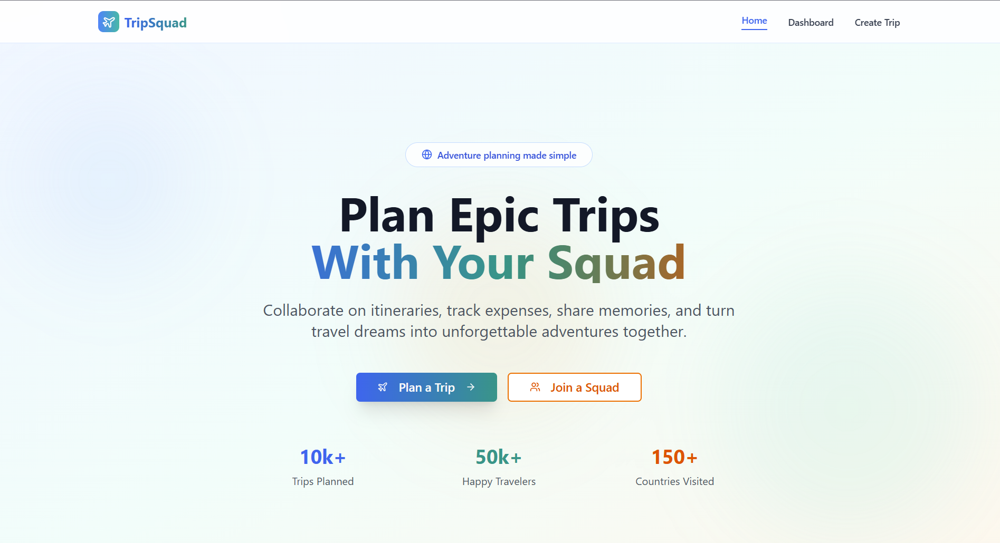
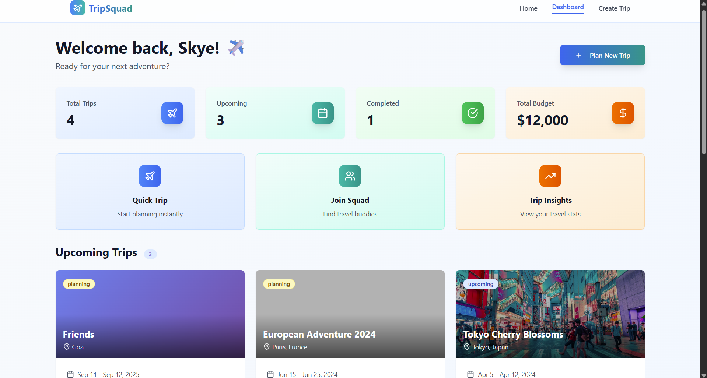
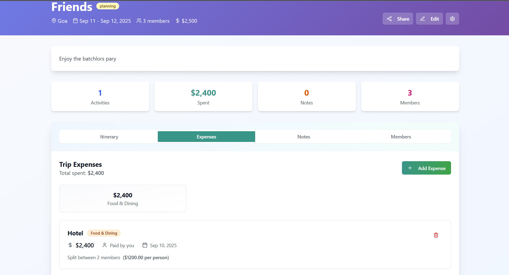

# 🌍 TripSquad

---

## 📸 Screenshots

| Homepage | Dashboard |
|----------|-----------|
|  |  |

| Itinerary | Expense Splitting |
|-----------|-------------------|
|  |  |

---

## 🌱 About TripSquad
**TripSquad** is a trip management web app designed to make travel planning collaborative and stress-free ✈️.  
From creating trips to splitting expenses, it helps friends and groups stay organized in one place.  

---

## 💡 Problem Statement
Planning group trips is often messy because:  
- Expenses are hard to track and split fairly.  
- It’s difficult to manage itineraries across multiple people.  
- Communication gets scattered across chats and apps.  

---

## 💡 Our Solution
We built **TripSquad**:  
- 🗓 **Centralized trip planning** with members and itineraries.  
- 💸 **Fair expense splitting** between participants.  
- 📝 **Notes & optional chat** for better collaboration.  
- 📊 **Dashboard view** for upcoming and past trips.  

---

## 🚀 Features
- 👥 **Dynamic Trip Members** – Add/remove details easily.  
- 🗓 **Itinerary Sharing** – Keep everyone on the same page.  
- 💸 **Expense Tracking & Splitting** – Automatically divide costs fairly.  
- 📊 **Dashboard** – View trips at a glance.  
- 🎨 **Modern UI** – Clean cards and layouts with Bootstrap/Material UI.  

---

## 🛠 Tech Stack
- **Frontend:** React.js, Bootstrap / Material UI  
- **Backend:** Core PHP  
- **Database:** MySQL  
- **Version Control:** Git & GitHub  

---

## 🚀 Getting Started

 1. Clone the Repository

    git clone https://github.com/your-username/tripsquad.git
    cd tripsquad

2. Frontend Setup (React)
   cd frontend
   npm install
   npm start

   Frontend runs at: http://localhost:5173

   

4. Backend Setup (PHP + MySQL)

    Move the backend folder to your XAMPP/LAMP htdocs directory.

    Import the provided database.sql file into MySQL.

    Update database credentials in backend/config.php.

Start Apache & MySQL servers, then access API via http://localhost/backend/.

📂 Project Structure
TripSquad/
│
├── frontend/           # React.js frontend
│   ├── src/            # Components & Pages
│   └── package.json
│
├── backend/            # PHP backend
│   ├── api/            # PHP APIs
│   └── config.php
│
└── database.sql        # MySQL schema

